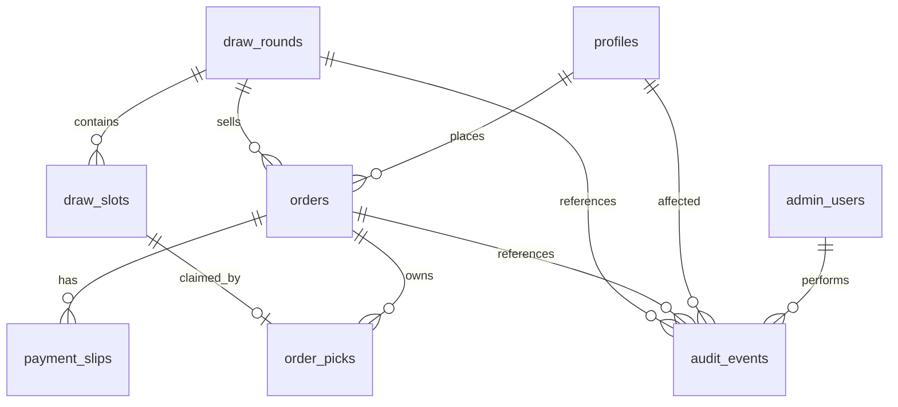

# Lucky Draw Database Architecture

Last updated: 2026-04-30

## 1. Goal

Lucky Draw needs a shared production database because order approval, slot picking, livestream admin actions, and customer views must be the same across every device. Local browser storage is useful for the first UI demo only.

Recommended stack for phase 1 production:

- Next.js on Vercel
- Supabase Postgres for database
- Supabase Realtime for live slot/order updates
- Supabase Storage for private payment slip files
- LINE LIFF login with server-side LINE ID token verification

Supabase references checked for this design:

- Row Level Security: https://supabase.com/docs/guides/database/postgres/row-level-security
- Realtime Postgres Changes: https://supabase.com/docs/guides/realtime/postgres-changes
- Storage private buckets and signed URLs: https://supabase.com/docs/guides/storage/buckets/fundamentals

## 2. Core Production Rules

1. Customer must log in with LINE before creating a paid order.
2. Customer pays first and uploads or sends a payment slip.
3. Order starts as `pending_payment_review`.
4. Admin approves the payment.
5. Approved order unlocks exactly `quantity` picks.
6. A slot number can belong to only one order in one draw round.
7. Customer can pick their own slots, or admin can pick slots for the customer during the livestream chat.
8. Every approval, rejection, manual pick, and slot change should be auditable.
9. Customer should see slot changes in real time after they or admin pick.
10. Admin should see new orders, payment slips, and slot changes in real time.

## 3. Entity Relationship Diagram



## 4. Tables

### 4.1 `profiles`

Stores minimum customer identity from LINE.

| Column | Type | Notes |
| --- | --- | --- |
| `id` | uuid primary key | Internal app user id |
| `line_user_id` | text unique not null | Stable LINE identity |
| `line_display_name` | text | Display only |
| `line_picture_url` | text | Optional |
| `preferred_language` | text | `th` or `en` |
| `created_at` | timestamptz | Default now |
| `updated_at` | timestamptz | Updated by trigger |

Do not store unnecessary personal details at launch.

### 4.2 `admin_users`

Controls who can access the admin page.

| Column | Type | Notes |
| --- | --- | --- |
| `id` | uuid primary key |
| `profile_id` | uuid references `profiles(id)` |
| `role` | text | `owner`, `admin`, `staff` |
| `is_active` | boolean |
| `created_at` | timestamptz |

For early production, we can manually insert admin LINE user IDs after your LINE LIFF channel is ready.

### 4.3 `draw_rounds`

One active selling round, for example One Piece or Pokemon.

| Column | Type | Notes |
| --- | --- | --- |
| `id` | uuid primary key |
| `slug` | text unique | Public route friendly id |
| `status` | text | `draft`, `live`, `closed`, `archived` |
| `series` | text | `one_piece`, `pokemon` |
| `title_th` | text |
| `title_en` | text |
| `price_thb` | integer | Price per draw |
| `total_slots` | integer | Envelope count |
| `facebook_live_url` | text |
| `youtube_embed_url` | text |
| `promptpay_id` | text |
| `bank_name` | text |
| `bank_account_name` | text |
| `bank_account_number` | text |
| `starts_at` | timestamptz |
| `created_by` | uuid references `admin_users(id)` |
| `created_at` | timestamptz |
| `updated_at` | timestamptz |

### 4.4 `draw_slots`

Pre-created slots for each envelope number.

| Column | Type | Notes |
| --- | --- | --- |
| `id` | uuid primary key |
| `draw_round_id` | uuid references `draw_rounds(id)` |
| `slot_number` | integer |
| `status` | text | `available`, `picked`, `opened`, `void` |
| `opened_at` | timestamptz |
| `created_at` | timestamptz |

Constraints:

- Unique: `(draw_round_id, slot_number)`
- Check: `slot_number >= 1`
- Slots should be generated when admin creates or publishes the draw.

### 4.5 `orders`

Represents one customer purchase request.

| Column | Type | Notes |
| --- | --- | --- |
| `id` | uuid primary key |
| `public_code` | text unique | Example `LD-1002` |
| `draw_round_id` | uuid references `draw_rounds(id)` |
| `profile_id` | uuid references `profiles(id)` |
| `quantity` | integer | Paid draw count |
| `amount_thb` | integer | `quantity * price_thb` at purchase time |
| `status` | text | See status model below |
| `admin_note` | text |
| `customer_note` | text |
| `approved_by` | uuid references `admin_users(id)` |
| `approved_at` | timestamptz |
| `rejected_by` | uuid references `admin_users(id)` |
| `rejected_at` | timestamptz |
| `created_at` | timestamptz |
| `updated_at` | timestamptz |

Order statuses:

- `pending_payment_review`: customer submitted payment/slip, waiting for admin.
- `payment_rejected`: admin rejected the slip or amount.
- `approved_for_pick`: payment approved, customer/admin can pick slots.
- `picked`: all paid slots are selected.
- `opened`: envelopes were opened on livestream.
- `cancelled`: admin cancelled the order.

### 4.6 `payment_slips`

Payment proof metadata. Phase 1 stores uploaded slip files in private Supabase Storage, or records `manual_line` when the customer sends the slip to LINE and admin checks it manually.

| Column | Type | Notes |
| --- | --- | --- |
| `id` | uuid primary key |
| `order_id` | uuid references `orders(id)` |
| `storage_provider` | text | `supabase`, `manual_line`; `cloudinary` remains legacy-compatible only |
| `file_path` | text | Private Supabase Storage path |
| `file_url` | text | Optional; avoid public URLs for bank slips |
| `original_filename` | text |
| `uploaded_at` | timestamptz |
| `reviewed_by` | uuid references `admin_users(id)` |
| `reviewed_at` | timestamptz |

For quickest launch, this table also supports `manual_line` where customer sends slip in LINE chat and admin approves manually. Paid slip-check API verification is future work and should not block Phase 1.

### 4.7 `order_picks`

Connects an approved order to its selected envelope numbers.

| Column | Type | Notes |
| --- | --- | --- |
| `id` | uuid primary key |
| `order_id` | uuid references `orders(id)` |
| `draw_slot_id` | uuid references `draw_slots(id)` |
| `picked_by_profile_id` | uuid references `profiles(id)` | Customer pick |
| `picked_by_admin_id` | uuid references `admin_users(id)` | Admin pick during livestream chat |
| `pick_source` | text | `customer`, `admin`, `system` |
| `created_at` | timestamptz |

Constraints:

- Unique: `draw_slot_id`
- Unique: `(order_id, draw_slot_id)`
- Pick count must not exceed `orders.quantity`. Enforce this through a database function, not only frontend code.

### 4.8 `audit_events`

Tracks operational history.

| Column | Type | Notes |
| --- | --- | --- |
| `id` | uuid primary key |
| `actor_profile_id` | uuid references `profiles(id)` |
| `actor_admin_id` | uuid references `admin_users(id)` |
| `event_type` | text | `order_created`, `payment_approved`, `slot_picked`, etc. |
| `draw_round_id` | uuid |
| `order_id` | uuid |
| `metadata` | jsonb |
| `created_at` | timestamptz |

## 5. Slot Picking Transaction

Slot picking must be atomic. Do not implement slot claiming as separate browser steps like:

1. Read available slots.
2. Insert pick.
3. Update slot status.

That can create race conditions when two people pick at the same time.

Use one Postgres RPC function such as `claim_order_slots(order_id, slot_numbers[])`:

1. Verify the user owns the order, or the caller is an active admin.
2. Verify order status is `approved_for_pick` or `picked`.
3. Lock the order row.
4. Lock requested slot rows with `FOR UPDATE`.
5. Reject if any requested slot is already picked by another order.
6. Reject if final pick count exceeds order quantity.
7. Insert missing `order_picks`.
8. Remove deselected picks only if the order is not opened.
9. Update `draw_slots.status`.
10. Update order status to `picked` when pick count equals quantity.
11. Write `audit_events`.

This same function can support:

- Customer self-pick from the pick page.
- Admin manual pick from the admin page.
- Livestream chat pick entered by staff.

## 6. Realtime Design

Enable Supabase Realtime for:

- `draw_rounds`
- `draw_slots`
- `orders`
- `order_picks`
- optionally `payment_slips`

Customer subscriptions:

- Active draw changes: stream link, status, price display.
- Slots for the active draw: show picked/available numbers instantly.
- Their own orders: payment approval and picked numbers.

Admin subscriptions:

- New pending orders.
- New or updated payment slips.
- All slot picks in the active draw.
- Order status changes.

Frontend behavior:

- When customer confirms a pick, optimistically highlight the selected slots.
- Re-fetch or reconcile after the Realtime event.
- If the database rejects a slot because another user/admin picked it first, show a clear message and refresh the slot board.

## 7. RLS And Security Model

Supabase tables in the public schema should have RLS enabled.

Recommended access pattern:

- Public/anonymous users can read only the currently live draw summary and public slot status.
- Logged-in customers can read and create their own orders.
- Logged-in customers can read their own payment slip metadata.
- Customers cannot approve payments, edit prices, edit stream links, or see other customers' slip files.
- Admin users can read and update operational data.
- Server-side Next.js routes can use privileged access for LINE token verification and signed upload URLs.
- Never expose Supabase `service_role` key in browser code.

Important implementation note:

Admin authorization should come from database membership (`admin_users`) or app metadata controlled by the server. Do not trust user-editable profile metadata for admin decisions.

## 8. Storage And Verification Decision

Phase 1:

- Admin manually checks all payment slips.
- Use a private Supabase Storage bucket named `payment-slips` for uploaded slip files.
- Store file path in `payment_slips.file_path`.
- Admin page requests a short-lived signed URL to view the slip.
- Keep `manual_line` as fallback when customer sends slip to LINE Official Account instead of uploading.

Future:

- Add paid slip-check API only after real order volume makes the cost worthwhile.
- API verification should assist admin review first, not automatically approve orders on day one.

## 9. Suggested SQL Skeleton

This is a planning skeleton, not the final migration.

```sql
create table public.profiles (
  id uuid primary key default gen_random_uuid(),
  line_user_id text unique not null,
  line_display_name text,
  line_picture_url text,
  preferred_language text not null default 'th',
  created_at timestamptz not null default now(),
  updated_at timestamptz not null default now()
);

create table public.admin_users (
  id uuid primary key default gen_random_uuid(),
  profile_id uuid not null references public.profiles(id),
  role text not null default 'staff',
  is_active boolean not null default true,
  created_at timestamptz not null default now()
);

create table public.draw_rounds (
  id uuid primary key default gen_random_uuid(),
  slug text unique not null,
  status text not null default 'draft',
  series text not null,
  title_th text not null,
  title_en text not null,
  price_thb integer not null check (price_thb > 0),
  total_slots integer not null check (total_slots > 0),
  facebook_live_url text,
  youtube_embed_url text,
  promptpay_id text,
  bank_name text,
  bank_account_name text,
  bank_account_number text,
  starts_at timestamptz,
  created_by uuid references public.admin_users(id),
  created_at timestamptz not null default now(),
  updated_at timestamptz not null default now()
);

create table public.draw_slots (
  id uuid primary key default gen_random_uuid(),
  draw_round_id uuid not null references public.draw_rounds(id) on delete cascade,
  slot_number integer not null check (slot_number >= 1),
  status text not null default 'available',
  opened_at timestamptz,
  created_at timestamptz not null default now(),
  unique (draw_round_id, slot_number)
);

create table public.orders (
  id uuid primary key default gen_random_uuid(),
  public_code text unique not null,
  draw_round_id uuid not null references public.draw_rounds(id),
  profile_id uuid not null references public.profiles(id),
  quantity integer not null check (quantity > 0),
  amount_thb integer not null check (amount_thb > 0),
  status text not null default 'pending_payment_review',
  admin_note text,
  customer_note text,
  approved_by uuid references public.admin_users(id),
  approved_at timestamptz,
  rejected_by uuid references public.admin_users(id),
  rejected_at timestamptz,
  created_at timestamptz not null default now(),
  updated_at timestamptz not null default now()
);

create table public.payment_slips (
  id uuid primary key default gen_random_uuid(),
  order_id uuid not null references public.orders(id) on delete cascade,
  storage_provider text not null default 'manual_line',
  file_path text,
  file_url text,
  original_filename text,
  uploaded_at timestamptz not null default now(),
  reviewed_by uuid references public.admin_users(id),
  reviewed_at timestamptz
);

create table public.order_picks (
  id uuid primary key default gen_random_uuid(),
  order_id uuid not null references public.orders(id) on delete cascade,
  draw_slot_id uuid not null references public.draw_slots(id),
  picked_by_profile_id uuid references public.profiles(id),
  picked_by_admin_id uuid references public.admin_users(id),
  pick_source text not null,
  created_at timestamptz not null default now(),
  unique (draw_slot_id),
  unique (order_id, draw_slot_id)
);

create table public.audit_events (
  id uuid primary key default gen_random_uuid(),
  actor_profile_id uuid references public.profiles(id),
  actor_admin_id uuid references public.admin_users(id),
  event_type text not null,
  draw_round_id uuid references public.draw_rounds(id),
  order_id uuid references public.orders(id),
  metadata jsonb not null default '{}'::jsonb,
  created_at timestamptz not null default now()
);
```

## 10. First Implementation Milestone

Build in this order:

1. Create Supabase project.
2. Add schema migration and RLS.
3. Add LINE LIFF login and server-side LINE token verification.
4. Replace localStorage draw/orders with Supabase queries.
5. Add admin login guard.
6. Add order creation and manual payment approval.
7. Add atomic slot-pick RPC.
8. Add protected Supabase Storage slip upload and manual admin review.
9. Add Realtime subscriptions for slots and orders.
10. Deploy to Vercel with environment variables.

## 11. Open Decisions

These need your final decision before implementation:

1. Exact first-launch slip proof requirement: uploaded file required, or manual LINE note allowed.
2. Admin identity: which LINE accounts should be owner/admin.
3. Whether customers outside LINE can browse only, or must be blocked completely.
4. Whether picked slots can be changed after they are announced on livestream.
5. Whether to store opened card results per envelope in phase 1 or phase 2.
