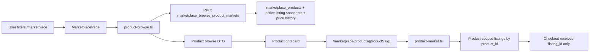

# Marketplace Product Grouping Implementation Plan

> **For agentic workers:** REQUIRED SUB-SKILL: Use superpower-subagent-driven-development (recommended) or superpower-executing-plans to implement this plan task-by-task. Steps use checkbox (`- [ ]`) syntax for tracking.

**Goal:** Change the YNOT marketplace browse page to work like a product market: two sellers with the same card or item appear as one product card, and the product page shows the active seller listings, source options, variants, image gallery, and price history.

**Architecture:** Keep listing and checkout logic listing-level, but make marketplace browse product-level. Add a product browse read model and RPC in the Marketplace Supabase stream, expose it through one canonical API route, and render product summaries on `/marketplace`. Product detail routes continue to load product, variants, listing offers, and price history, but active listings are queried by `product_id` in the database instead of filtering a generic listing page in memory.

**Tech Stack:** Next.js App Router 16, React 19, TypeScript strict, Supabase/PostgreSQL migrations and RPCs, Cloudflare Workers via OpenNext, existing marketplace service modules, existing marketplace route guards, Node `node:test` static architecture tests.

---

## Product Rule

The marketplace identity rule is:

```text
Same sellable item = same marketplace_products.id / marketplace_products.product_slug.
Different seller offer = different marketplace_listing_snapshots.listing_id.
Checkout = always a listing_id.
Browse card = always a product_slug.
```

Example:

```text
Product: EB02-001 Roronoa Zoro
Listings:
- official_shop listing A, THB 4,200
- user_seller listing B, THB 3,900

/marketplace:
- one EB02-001 product card
- "From THB 3,900"
- "2 listings"
- source chips show Official Shop and User Sellers availability

/marketplace/products/eb02-001-roronoa-zoro:
- product gallery, variant chips, price history
- listing rows for THB 3,900 and THB 4,200
- buyer selects one listing before checkout
```

Do not group by seller, title text, image URL, or price. Group only by canonical `product_id`.

## User-Facing Result

- `/marketplace` shows grouped products, not individual seller listings.
- Filters update the selected product set smoothly and keep URL state.
- Source chips use short, clear labels: `All`, `YNOT Shop`, `User Sellers`.
- Sort options are clear: `Recommended`, `Newest`, `Lowest price`, `Highest price`, `Recently sold`.
- Product cards use `From THB 3,900`, `2 listings`, and `View prices` style copy.
- `/marketplace/products/[productSlug]` shows all active offers for that product and the market price history.
- Buying remains paused only when the existing marketplace action gate says checkout is disabled. The browse UI must not show unrelated launch copy.
- Admin and seller dashboards stay listing-level because operations, fulfilment, payouts, and audit records are seller/listing-specific.

## File Structure

| File | Responsibility |
|---|---|
| `docs/superpowers/plans/2026-06-29-marketplace-product-grouping.md` | This plan. |
| `Database/marketplace-supabase/migrations/20260629180000_marketplace_product_browse_read_model.sql` | Product browse search column, indexes, and `marketplace_browse_product_markets` RPC. |
| `Website/scripts/test-marketplace-product-grouping-architecture.mjs` | Failing-first static contract for grouped browse, API route, RPC, product-scoped listing queries, and public projection. |
| `Website/package.json` | Add `test:marketplace-product-grouping` and include it in marketplace verification. |
| `Website/src/lib/marketplace/query-plan.ts` | Add product-browse sort vocabulary and keep query parsing allowlisted. |
| `Website/src/lib/marketplace/product-browse.ts` | New server module for product browse DTOs, cursor encoding, RPC call, and mock grouping. |
| `Website/src/lib/marketplace/listings.ts` | Add optional `productId` and `variantId` filters for product detail listing queries. |
| `Website/src/lib/marketplace/product-market.ts` | Use product-scoped listing query instead of loading the generic listing page and filtering after the fact. |
| `Website/src/lib/marketplace/public-projection.ts` | Add public projection for product browse summaries. |
| `Website/src/lib/marketplace/mock-data.ts` | Ensure local mock data contains duplicate listings for the same product slug. |
| `Website/src/app/api/ynot/marketplace/products/route.ts` | Canonical product browse API. |
| `Website/src/app/api/marketplace/products/route.ts` | Public alias re-export for product browse API. |
| `Website/src/app/(store)/marketplace/page.tsx` | Load product browse summaries instead of listing snapshots. |
| `Website/src/features/ynot/components.tsx` | Render product cards and clearer filter/sort copy. |
| `Website/src/features/ynot/MarketplaceProductBrowseClient.tsx` | Smooth filter client for product grid data refreshes. |
| `Website/src/features/ynot/MarketplaceProductPage.tsx` | Confirm product detail offer list wording and listing-level buy actions. |
| `Website/src/app/globals.css` | Product card, source chip, and loading-state styling. |
| `Website/tools/verification/verify-marketplace-rpc-contracts.mjs` | Add RPC presence and grant checks for product browse. |
| `Website/tools/verification/verify-marketplace-hardening.mjs` | Add public DTO leakage checks for grouped browse. |

---

## Data Flow



## API/RPC Contract

### Public API

`GET /api/marketplace/products`

Accepted query params:

```ts
type MarketplaceProductBrowseApiQuery = {
  source?: "official_shop" | "user_seller";
  itemType?: "card" | "sealed_box" | "sealed_pack";
  q?: string;
  condition?: "raw_a" | "raw_b" | "raw_c" | "raw_d";
  grade?:
    | "psa_10"
    | "psa_9"
    | "psa_8_or_under"
    | "bgs_10_black_label"
    | "bgs_10_gold_label"
    | "bgs_9_5"
    | "bgs_9_or_under"
    | "ars_10_plus"
    | "ars_10"
    | "ars_9"
    | "ars_8_or_under"
    | "other_graded";
  sort?: "recommended" | "popular" | "newest" | "price_asc" | "price_desc" | "recent_sales";
  limit?: string;
  cursor?: string;
};
```

Response:

```ts
type MarketplaceProductBrowseApiResponse = {
  ok: true;
  request_id: string;
  products: MarketplaceProductBrowseSummary[];
  next_cursor: string | null;
};

type MarketplaceProductBrowseSummary = {
  product_id: string;
  product_slug: string;
  title: string;
  brand: string | null;
  category: string | null;
  series_name: string | null;
  set_name: string | null;
  card_code: string | null;
  language: string | null;
  hero_image_url: string | null;
  product_metadata: Record<string, string | number | boolean | null>;
  active_listing_count: number;
  official_listing_count: number;
  user_seller_listing_count: number;
  variant_count: number;
  lowest_price_satang: number;
  highest_price_satang: number;
  recent_listing_at: string | null;
  sold_count: number;
  last_sold_at: string | null;
  ranking_score: number;
};
```

### Supabase RPC

Server-side code calls:

```ts
const { data, error } = await supabase.rpc("marketplace_browse_product_markets", {
  p_source: query.source ?? null,
  p_item_type: query.itemType ?? null,
  p_q: query.q ?? null,
  p_condition: query.condition ?? null,
  p_grade: query.grade ?? null,
  p_sort: sort,
  p_limit: limit + 1,
  p_after_product_slug: cursor?.productSlug ?? null,
  p_after_price_satang: cursor?.lowestPriceSatang ?? null,
  p_after_recent_at: cursor?.recentAt ?? null,
  p_after_ranking_score: cursor?.rankingScore ?? null,
});
```

The RPC is executable by `service_role` only. Browser clients never call Supabase directly.

---

## Task 1: Add A Failing Product Grouping Contract

**Files:**
- Create `Website/scripts/test-marketplace-product-grouping-architecture.mjs`
- Modify `Website/package.json`

- [ ] Add `test:marketplace-product-grouping` to `Website/package.json`:

```json
{
  "scripts": {
    "test:marketplace-product-grouping": "node --test scripts/test-marketplace-product-grouping-architecture.mjs"
  }
}
```

- [ ] Create `Website/scripts/test-marketplace-product-grouping-architecture.mjs`:

```js
import assert from "node:assert/strict";
import { existsSync, readFileSync } from "node:fs";
import path from "node:path";
import { fileURLToPath } from "node:url";
import test from "node:test";

const appRoot = path.resolve(path.dirname(fileURLToPath(import.meta.url)), "..");
const repoRoot = path.resolve(appRoot, "..");
const migrationPath = path.join(
  repoRoot,
  "Database/marketplace-supabase/migrations/20260629180000_marketplace_product_browse_read_model.sql",
);

function readApp(relPath) {
  return readFileSync(path.join(appRoot, relPath), "utf8");
}

function readRepo(relPath) {
  return readFileSync(path.join(repoRoot, relPath), "utf8");
}

function compact(source) {
  return source.replace(/\/\*[\s\S]*?\*\//g, "").replace(/--.*$/gm, "").replace(/\s+/g, " ");
}

function requirePattern(source, pattern, label) {
  assert.match(source, pattern, label);
}

test("package exposes product grouping architecture test", () => {
  const packageJson = JSON.parse(readApp("package.json"));
  assert.equal(
    packageJson.scripts["test:marketplace-product-grouping"],
    "node --test scripts/test-marketplace-product-grouping-architecture.mjs",
  );
});

test("database exposes service-role product browse rpc with performance indexes", () => {
  assert.ok(existsSync(migrationPath), "missing product browse migration");
  const sql = compact(readFileSync(migrationPath, "utf8").toLowerCase());

  requirePattern(sql, /create extension if not exists pg_trgm/, "missing trigram search extension");
  requirePattern(sql, /marketplace_products_search_trgm_idx/, "missing product search index");
  requirePattern(sql, /marketplace_listing_product_active_browse_idx/, "missing active product listing index");
  requirePattern(sql, /marketplace_price_history_product_recent_idx/, "missing recent price history index");
  requirePattern(sql, /create or replace function public\.marketplace_browse_product_markets/, "missing browse RPC");
  requirePattern(sql, /security definer/, "browse RPC must be security definer");
  requirePattern(sql, /set search_path = public, pg_temp/, "browse RPC must lock search_path");
  requirePattern(sql, /revoke all on function public\.marketplace_browse_product_markets/, "browse RPC must revoke public execute");
  requirePattern(sql, /grant execute on function public\.marketplace_browse_product_markets/, "browse RPC must grant service_role execute");
});

test("product browse module owns RPC call, cursor, and mock grouping", () => {
  const source = readApp("src/lib/marketplace/product-browse.ts");

  requirePattern(source, /MarketplaceProductBrowseSummary/, "missing browse summary type");
  requirePattern(source, /listMarketplaceProductBrowsePage/, "missing browse page loader");
  requirePattern(source, /\.rpc\("marketplace_browse_product_markets"/, "missing RPC call");
  requirePattern(source, /encodeProductBrowseCursor/, "missing cursor encoder");
  requirePattern(source, /decodeProductBrowseCursor/, "missing cursor decoder");
  requirePattern(source, /mockMarketplaceListings/, "mock mode must group existing listing data");
  requirePattern(source, /productSlug/, "mock grouping must use product slug identity");
});

test("public routes expose product browse through canonical and alias APIs", () => {
  for (const relPath of [
    "src/app/api/ynot/marketplace/products/route.ts",
    "src/app/api/marketplace/products/route.ts",
  ]) {
    assert.ok(existsSync(path.join(appRoot, relPath)), `missing ${relPath}`);
  }

  const canonical = readApp("src/app/api/ynot/marketplace/products/route.ts");
  requirePattern(canonical, /listMarketplaceProductBrowsePage/, "canonical route must call product browse loader");
  requirePattern(canonical, /marketplaceQueryPlanFromUrl/, "canonical route must use allowlisted query parser");
  requirePattern(canonical, /publicMarketplaceAccess/, "canonical route must preserve public access gate");
  requirePattern(canonical, /enforceRateLimit/, "canonical route must rate limit reads");
  requirePattern(canonical, /Cache-Control/, "canonical route must set explicit cache header");

  const alias = readApp("src/app/api/marketplace/products/route.ts");
  requirePattern(alias, /api\/ynot\/marketplace\/products\/route/, "alias must re-export canonical route");
});

test("marketplace page renders product browse cards instead of listing snapshots", () => {
  const page = readApp("src/app/(store)/marketplace/page.tsx");
  const components = readApp("src/features/ynot/components.tsx");

  requirePattern(page, /listMarketplaceProductBrowsePage/, "page must load grouped product browse data");
  assert.doesNotMatch(page, /listMarketplaceListings\(listingQuery\)/, "page must not load listing cards for browse grid");
  requirePattern(components, /marketplaceProducts/, "component props must use products");
  requirePattern(components, /lowest_price_satang/, "cards must show from price");
  requirePattern(components, /active_listing_count/, "cards must show listing count");
  requirePattern(components, /\/marketplace\/products\/\$\{product\.product_slug\}/, "cards must link to product page");
  requirePattern(components, /View prices/, "CTA copy must explain product-market action");
});

test("product detail queries listings by product id in the database", () => {
  const listings = readApp("src/lib/marketplace/listings.ts");
  const productMarket = readApp("src/lib/marketplace/product-market.ts");

  requirePattern(listings, /productId\?: string/, "listing query must accept productId");
  requirePattern(listings, /\.eq\("product_id", options\.productId\)/, "listing query must filter product_id in database");
  requirePattern(productMarket, /productId: product\.id/, "product market must pass product id to listing query");
  assert.doesNotMatch(
    productMarket,
    /listingPage\.listings\.filter\(\(listing\) => listing\.product_id === product\.id\)/,
    "product market must not filter generic listing pages in memory",
  );
});

test("public projection exposes browse summaries without seller private fields", () => {
  const projection = readApp("src/lib/marketplace/public-projection.ts");
  requirePattern(projection, /projectPublicProductBrowseSummary/, "missing browse projection");
  assert.doesNotMatch(
    projection,
    /seller_marketplace_account_id|ynot_profile_id|sellerPayout|privateAdminNote|procurementNote/,
    "public browse projection must not expose private marketplace fields",
  );
});

test("mock data contains duplicate listings for one product slug", () => {
  const mockData = readApp("src/lib/marketplace/mock-data.ts");
  const matches = mockData.match(/productSlug:\s*"eb02-001-roronoa-zoro"/g) ?? [];
  assert.ok(matches.length >= 2, "mock browse must prove two listings group into one product");
});
```

- [ ] Run the test and confirm it fails for the expected missing surfaces:

```bash
cd /Users/pinkmerry/Project\ X/YNOTT/Website
npm run test:marketplace-product-grouping
```

Expected failure class:

```text
missing product browse migration
missing src/lib/marketplace/product-browse.ts
```

- [ ] Commit after the red test is in place:

```bash
git add Website/package.json Website/scripts/test-marketplace-product-grouping-architecture.mjs
git commit -m "Guard product-level marketplace browse"
```

---

## Task 2: Add Product Browse RPC And Indexes

**Files:**
- Create `Database/marketplace-supabase/migrations/20260629180000_marketplace_product_browse_read_model.sql`
- Modify `Website/tools/verification/verify-marketplace-rpc-contracts.mjs`

- [ ] Create the migration with the search column, indexes, and service-role RPC:

```sql
-- Product-level marketplace browse read model.
-- Browsing groups active seller/official listings by canonical marketplace product.

create extension if not exists pg_trgm with schema extensions;

alter table public.marketplace_products
  add column if not exists search_text text generated always as (
    lower(
      coalesce(title, '') || ' ' ||
      coalesce(brand, '') || ' ' ||
      coalesce(category, '') || ' ' ||
      coalesce(series_name, '') || ' ' ||
      coalesce(set_name, '') || ' ' ||
      coalesce(card_code, '') || ' ' ||
      coalesce(language, '') || ' ' ||
      coalesce(product_metadata ->> 'productCode', '') || ' ' ||
      coalesce(product_metadata ->> 'setNumber', '')
    )
  ) stored;

create index if not exists marketplace_products_search_trgm_idx
  on public.marketplace_products using gin (search_text extensions.gin_trgm_ops);

create index if not exists marketplace_listing_product_active_browse_idx
  on public.marketplace_listing_snapshots(
    product_id,
    listing_source,
    item_price_satang,
    visible_from desc,
    listing_id
  )
  where listing_state = 'active'
    and product_id is not null
    and quantity_available_snapshot > 0;

create index if not exists marketplace_listing_product_variant_active_browse_idx
  on public.marketplace_listing_snapshots(
    product_id,
    variant_id,
    item_price_satang,
    visible_from desc,
    listing_id
  )
  where listing_state = 'active'
    and product_id is not null
    and quantity_available_snapshot > 0;

create index if not exists marketplace_price_history_product_recent_idx
  on public.marketplace_price_history_points(product_id, sold_at desc);

create or replace function public.marketplace_browse_product_markets(
  p_source text default null,
  p_item_type text default null,
  p_q text default null,
  p_condition text default null,
  p_grade text default null,
  p_sort text default 'recommended',
  p_limit integer default 24,
  p_after_product_slug text default null,
  p_after_price_satang integer default null,
  p_after_recent_at timestamptz default null,
  p_after_ranking_score numeric default null
)
returns table (
  product_id uuid,
  product_slug text,
  title text,
  brand text,
  category text,
  series_name text,
  set_name text,
  card_code text,
  language text,
  hero_image_url text,
  product_metadata jsonb,
  active_listing_count integer,
  official_listing_count integer,
  user_seller_listing_count integer,
  variant_count integer,
  lowest_price_satang integer,
  highest_price_satang integer,
  recent_listing_at timestamptz,
  sold_count integer,
  last_sold_at timestamptz,
  ranking_score numeric
)
language plpgsql
security definer
set search_path = public, pg_temp
as $$
declare
  safe_limit integer := least(greatest(coalesce(p_limit, 24), 1), 51);
  safe_sort text := case
    when p_sort in ('recommended', 'popular', 'newest', 'price_asc', 'price_desc', 'recent_sales') then p_sort
    else 'recommended'
  end;
  normalized_q text := nullif(lower(trim(coalesce(p_q, ''))), '');
  condition_or_grade text := nullif(trim(coalesce(p_grade, p_condition, '')), '');
begin
  if p_source is not null and p_source not in ('official_shop', 'user_seller') then
    raise exception 'marketplace_source_invalid';
  end if;

  if p_item_type is not null and p_item_type not in ('card', 'sealed_box', 'sealed_pack') then
    raise exception 'marketplace_item_type_invalid';
  end if;

  return query
  with active_listing as (
    select listing.*
    from public.marketplace_listing_snapshots listing
    where listing.listing_state = 'active'
      and listing.product_id is not null
      and listing.quantity_available_snapshot > 0
      and (p_source is null or listing.listing_source = p_source)
      and (p_item_type is null or listing.snapshot_payload ->> 'itemType' = p_item_type)
      and (condition_or_grade is null or listing.snapshot_payload ->> 'conditionBucket' = condition_or_grade)
  ),
  listing_stats as (
    select
      listing.product_id,
      count(*)::integer as active_listing_count,
      count(*) filter (where listing.listing_source = 'official_shop')::integer as official_listing_count,
      count(*) filter (where listing.listing_source = 'user_seller')::integer as user_seller_listing_count,
      count(distinct listing.variant_id)::integer as variant_count,
      min(listing.item_price_satang)::integer as lowest_price_satang,
      max(listing.item_price_satang)::integer as highest_price_satang,
      max(coalesce(listing.visible_from, listing.updated_at)) as recent_listing_at
    from active_listing listing
    group by listing.product_id
  ),
  sold_stats as (
    select
      history.product_id,
      count(*)::integer as sold_count,
      max(history.sold_at) as last_sold_at
    from public.marketplace_price_history_points history
    where (p_source is null or history.listing_source = p_source)
      and (condition_or_grade is null or history.condition_bucket = condition_or_grade)
    group by history.product_id
  ),
  ranked as (
    select
      product.id as product_id,
      product.product_slug,
      product.title,
      product.brand,
      product.category,
      product.series_name,
      product.set_name,
      product.card_code,
      product.language,
      product.hero_image_url,
      product.product_metadata,
      stats.active_listing_count,
      stats.official_listing_count,
      stats.user_seller_listing_count,
      greatest(stats.variant_count, 1)::integer as variant_count,
      stats.lowest_price_satang,
      stats.highest_price_satang,
      stats.recent_listing_at,
      coalesce(sold.sold_count, 0)::integer as sold_count,
      sold.last_sold_at,
      (
        coalesce(sold.sold_count, 0)::numeric * 100
        + stats.active_listing_count::numeric * 10
        + greatest(0, 30 - extract(epoch from (now() - stats.recent_listing_at)) / 86400)::numeric
      ) as ranking_score
    from public.marketplace_products product
    join listing_stats stats on stats.product_id = product.id
    left join sold_stats sold on sold.product_id = product.id
    where normalized_q is null
      or product.search_text ilike '%' || replace(replace(normalized_q, '%', ''), '_', '') || '%'
  )
  select
    ranked.product_id,
    ranked.product_slug,
    ranked.title,
    ranked.brand,
    ranked.category,
    ranked.series_name,
    ranked.set_name,
    ranked.card_code,
    ranked.language,
    ranked.hero_image_url,
    ranked.product_metadata,
    ranked.active_listing_count,
    ranked.official_listing_count,
    ranked.user_seller_listing_count,
    ranked.variant_count,
    ranked.lowest_price_satang,
    ranked.highest_price_satang,
    ranked.recent_listing_at,
    ranked.sold_count,
    ranked.last_sold_at,
    ranked.ranking_score
  from ranked
  where p_after_product_slug is null
    or (
      safe_sort = 'price_asc'
      and (
        ranked.lowest_price_satang > coalesce(p_after_price_satang, -1)
        or (
          ranked.lowest_price_satang = coalesce(p_after_price_satang, -1)
          and ranked.product_slug > p_after_product_slug
        )
      )
    )
    or (
      safe_sort = 'price_desc'
      and (
        ranked.lowest_price_satang < coalesce(p_after_price_satang, 2147483647)
        or (
          ranked.lowest_price_satang = coalesce(p_after_price_satang, 2147483647)
          and ranked.product_slug < p_after_product_slug
        )
      )
    )
    or (
      safe_sort in ('newest', 'recent_sales')
      and (
        coalesce(case when safe_sort = 'recent_sales' then ranked.last_sold_at else ranked.recent_listing_at end, '-infinity'::timestamptz) < coalesce(p_after_recent_at, 'infinity'::timestamptz)
        or (
          coalesce(case when safe_sort = 'recent_sales' then ranked.last_sold_at else ranked.recent_listing_at end, '-infinity'::timestamptz) = coalesce(p_after_recent_at, 'infinity'::timestamptz)
          and ranked.product_slug < p_after_product_slug
        )
      )
    )
    or (
      safe_sort in ('recommended', 'popular')
      and (
        ranked.ranking_score < coalesce(p_after_ranking_score, 999999999)
        or (
          ranked.ranking_score = coalesce(p_after_ranking_score, 999999999)
          and ranked.product_slug < p_after_product_slug
        )
      )
    )
  order by
    case when safe_sort = 'price_asc' then ranked.lowest_price_satang end asc nulls last,
    case when safe_sort = 'price_asc' then ranked.product_slug end asc,
    case when safe_sort = 'price_desc' then ranked.lowest_price_satang end desc nulls last,
    case when safe_sort = 'price_desc' then ranked.product_slug end desc,
    case when safe_sort = 'newest' then ranked.recent_listing_at end desc nulls last,
    case when safe_sort = 'recent_sales' then ranked.last_sold_at end desc nulls last,
    case when safe_sort in ('recommended', 'popular') then ranked.ranking_score end desc,
    ranked.product_slug desc
  limit safe_limit;
end;
$$;

revoke all on function public.marketplace_browse_product_markets(
  text,
  text,
  text,
  text,
  text,
  text,
  integer,
  text,
  integer,
  timestamptz,
  numeric
) from public, anon, authenticated;

grant execute on function public.marketplace_browse_product_markets(
  text,
  text,
  text,
  text,
  text,
  text,
  integer,
  text,
  integer,
  timestamptz,
  numeric
) to service_role;
```

- [ ] Add `marketplace_browse_product_markets` checks to `Website/tools/verification/verify-marketplace-rpc-contracts.mjs`.

- [ ] Run:

```bash
cd /Users/pinkmerry/Project\ X/YNOTT/Website
npm run test:marketplace-product-grouping
npm run verify:marketplace-rpc-contracts
```

- [ ] Commit:

```bash
git add Database/marketplace-supabase/migrations/20260629180000_marketplace_product_browse_read_model.sql Website/tools/verification/verify-marketplace-rpc-contracts.mjs
git commit -m "Add product browse read model"
```

---

## Task 3: Add Product Browse Server Module

**Files:**
- Create `Website/src/lib/marketplace/product-browse.ts`
- Modify `Website/src/lib/marketplace/query-plan.ts`
- Modify `Website/src/lib/marketplace/public-projection.ts`
- Modify `Website/src/lib/marketplace/mock-data.ts`

- [ ] Extend sort vocabulary in `query-plan.ts`:

```ts
export type MarketplaceProductSort =
  | "recommended"
  | "popular"
  | "newest"
  | "price_asc"
  | "price_desc"
  | "recent_sales";

const SORTS = new Set([
  "recommended",
  "popular",
  "newest",
  "price_asc",
  "price_desc",
  "recent_sales",
]);
```

Default product sort must be `recommended`.

- [ ] Add public browse projection:

```ts
export function projectPublicProductBrowseSummary<
  T extends { product_metadata?: unknown; ranking_score?: unknown },
>(row: T) {
  return {
    ...row,
    product_metadata: pickRecord(row.product_metadata, PUBLIC_PRODUCT_METADATA_KEYS),
    ranking_score: Number(row.ranking_score ?? 0),
  };
}
```

- [ ] Create `product-browse.ts` with this shape:

```ts
import "server-only";

import { marketplaceConfig } from "./config";
import { mockMarketplaceListings } from "./mock-data";
import { projectPublicProductBrowseSummary } from "./public-projection";
import type { MarketplaceQueryPlan, MarketplaceProductSort } from "./query-plan";
import {
  createMarketplaceSupabaseClient,
  marketplaceRpcError,
  MarketplaceServiceError,
} from "./supabase-adapter";

type ProductBrowseCursorPayload = {
  v: 1;
  sort: MarketplaceProductSort;
  source: string | null;
  itemType: string | null;
  q: string | null;
  condition: string | null;
  grade: string | null;
  productSlug: string;
  lowestPriceSatang: number | null;
  recentAt: string | null;
  rankingScore: number | null;
};

export type MarketplaceProductBrowseSummary = {
  product_id: string;
  product_slug: string;
  title: string;
  brand: string | null;
  category: string | null;
  series_name: string | null;
  set_name: string | null;
  card_code: string | null;
  language: string | null;
  hero_image_url: string | null;
  product_metadata: Record<string, unknown>;
  active_listing_count: number;
  official_listing_count: number;
  user_seller_listing_count: number;
  variant_count: number;
  lowest_price_satang: number;
  highest_price_satang: number;
  recent_listing_at: string | null;
  sold_count: number;
  last_sold_at: string | null;
  ranking_score: number;
};

export type MarketplaceProductBrowsePage = {
  products: MarketplaceProductBrowseSummary[];
  nextCursor: string | null;
};

const MAX_PRODUCT_BROWSE_LIMIT = 50;
const DEFAULT_PRODUCT_BROWSE_LIMIT = 24;
const MAX_CURSOR_BYTES = 768;

function productBrowseLimit(value: number | undefined) {
  if (!value || value < 1) return DEFAULT_PRODUCT_BROWSE_LIMIT;
  return Math.min(value, MAX_PRODUCT_BROWSE_LIMIT);
}

function productBrowseSort(sort: MarketplaceQueryPlan["sort"]): MarketplaceProductSort {
  if (
    sort === "popular" ||
    sort === "newest" ||
    sort === "price_asc" ||
    sort === "price_desc" ||
    sort === "recent_sales"
  ) {
    return sort;
  }
  return "recommended";
}

function cursorIdentity(query: MarketplaceQueryPlan, sort: MarketplaceProductSort) {
  return {
    sort,
    source: query.source ?? null,
    itemType: query.itemType ?? null,
    q: query.q ?? null,
    condition: query.condition ?? null,
    grade: query.grade ?? null,
  };
}

export function encodeProductBrowseCursor(
  product: MarketplaceProductBrowseSummary,
  query: MarketplaceQueryPlan,
  sort: MarketplaceProductSort,
) {
  const payload: ProductBrowseCursorPayload = {
    v: 1,
    ...cursorIdentity(query, sort),
    productSlug: product.product_slug,
    lowestPriceSatang: product.lowest_price_satang,
    recentAt: sort === "recent_sales" ? product.last_sold_at : product.recent_listing_at,
    rankingScore: product.ranking_score,
  };
  return btoa(JSON.stringify(payload))
    .replace(/\+/g, "-")
    .replace(/\//g, "_")
    .replace(/=+$/g, "");
}

export function decodeProductBrowseCursor(
  rawCursor: string | null | undefined,
  query: MarketplaceQueryPlan,
  sort: MarketplaceProductSort,
) {
  if (!rawCursor) return null;
  if (rawCursor.length > MAX_CURSOR_BYTES) {
    throw new MarketplaceServiceError(
      "marketplace_cursor_invalid",
      "Marketplace cursor is invalid.",
      400,
    );
  }

  try {
    const normalized = rawCursor.replace(/-/g, "+").replace(/_/g, "/");
    const padded = normalized.padEnd(Math.ceil(normalized.length / 4) * 4, "=");
    const payload = JSON.parse(atob(padded)) as Partial<ProductBrowseCursorPayload>;
    const identity = cursorIdentity(query, sort);
    if (
      payload.v !== 1 ||
      payload.sort !== identity.sort ||
      payload.source !== identity.source ||
      payload.itemType !== identity.itemType ||
      payload.q !== identity.q ||
      payload.condition !== identity.condition ||
      payload.grade !== identity.grade ||
      typeof payload.productSlug !== "string" ||
      !/^[a-z0-9][a-z0-9-]{2,220}$/.test(payload.productSlug)
    ) {
      throw new Error("cursor mismatch");
    }
    return payload as ProductBrowseCursorPayload;
  } catch {
    throw new MarketplaceServiceError(
      "marketplace_cursor_invalid",
      "Marketplace cursor is invalid.",
      400,
    );
  }
}

export async function listMarketplaceProductBrowsePage(
  query: MarketplaceQueryPlan,
): Promise<MarketplaceProductBrowsePage> {
  const limit = productBrowseLimit(query.limit);
  const sort = productBrowseSort(query.sort);
  const cursor = decodeProductBrowseCursor(query.cursor, query, sort);

  if (marketplaceConfig().mockData) {
    return mockMarketplaceProductBrowsePage(query, limit, sort);
  }

  const supabase = createMarketplaceSupabaseClient();
  const result = await supabase.rpc("marketplace_browse_product_markets", {
    p_source: query.source ?? null,
    p_item_type: query.itemType ?? null,
    p_q: query.q ?? null,
    p_condition: query.condition ?? null,
    p_grade: query.grade ?? null,
    p_sort: sort,
    p_limit: limit + 1,
    p_after_product_slug: cursor?.productSlug ?? null,
    p_after_price_satang: cursor?.lowestPriceSatang ?? null,
    p_after_recent_at: cursor?.recentAt ?? null,
    p_after_ranking_score: cursor?.rankingScore ?? null,
  });

  if (result.error) throw marketplaceRpcError(result.error);
  const rows = ((result.data ?? []) as unknown[]).map((row) =>
    projectPublicProductBrowseSummary(row as Record<string, unknown>),
  ) as MarketplaceProductBrowseSummary[];
  const products = rows.slice(0, limit);
  return {
    products,
    nextCursor:
      rows.length > limit
        ? encodeProductBrowseCursor(products[products.length - 1], query, sort)
        : null,
  };
}
```

- [ ] Implement `mockMarketplaceProductBrowsePage()` in the same module by grouping `mockMarketplaceListings` by `snapshot_payload.productSlug`, computing the lowest price and counts, then applying the same source, item type, condition, grade, search, and sort rules.

- [ ] Update `mock-data.ts` so at least two active mock listings share:

```ts
snapshot_payload: {
  itemType: "card",
  productSlug: "eb02-001-roronoa-zoro",
  variantSlug: "raw-a",
  variantLabel: "Raw A",
  conditionBucket: "raw_a",
}
```

Set one duplicate to `listing_source: "official_shop"`, and set one duplicate to `listing_source: "user_seller"`.

- [ ] Run:

```bash
cd /Users/pinkmerry/Project\ X/YNOTT/Website
npm run test:marketplace-product-grouping
npm run test:marketplace-product-market
```

- [ ] Commit:

```bash
git add Website/src/lib/marketplace/product-browse.ts Website/src/lib/marketplace/query-plan.ts Website/src/lib/marketplace/public-projection.ts Website/src/lib/marketplace/mock-data.ts
git commit -m "Group marketplace browse by product"
```

---

## Task 4: Fix Product Detail Listing Query Performance

**Files:**
- Modify `Website/src/lib/marketplace/listings.ts`
- Modify `Website/src/lib/marketplace/product-market.ts`

- [ ] Add product and variant filters to `MarketplaceListingQuery`:

```ts
export type MarketplaceListingQuery = {
  productId?: string;
  variantId?: string;
  source?: MarketplaceListingSource;
  itemType?: MarketplaceListingItemType;
  q?: string;
  condition?: string;
  grade?: string;
  inStockOnly?: boolean;
  sort?: MarketplaceListingSort;
  limit?: number;
  cursor?: string | null;
};
```

- [ ] Include `productId` and `variantId` in the cursor identity:

```ts
type ListingCursorPayload = {
  v: 1;
  sort: MarketplaceListingSort;
  productId: string | null;
  variantId: string | null;
  source: MarketplaceListingSource | null;
  itemType: MarketplaceListingItemType | null;
  q: string | null;
  listingId: string;
  visibleFrom: string | null;
  itemPriceSatang: number;
};
```

- [ ] Apply database filters before ordering:

```ts
if (options.productId) {
  query = query.eq("product_id", assertUuid(options.productId, "product_id"));
}
if (options.variantId) {
  query = query.eq("variant_id", assertUuid(options.variantId, "variant_id"));
}
```

- [ ] Change `getMarketplaceProductMarket()` so the listing query is product-scoped:

```ts
const [variantResult, listingPage, priceHistory] = await Promise.all([
  supabase
    .from("marketplace_product_variants")
    .select(VARIANT_SELECT)
    .eq("product_id", product.id)
    .order("updated_at", { ascending: false })
    .limit(24),
  listMarketplaceListingPage({
    ...listingQueryFromPlan(query),
    productId: product.id,
    limit: Math.min(query.limit, 40),
  }),
  listMarketplaceProductPriceHistory(product.id, query),
]);
```

- [ ] Remove all `listingPage.listings.filter((listing) => listing.product_id === product.id)` logic from production mode.

- [ ] Run:

```bash
cd /Users/pinkmerry/Project\ X/YNOTT/Website
npm run test:marketplace-product-grouping
npm run test:marketplace-product-market
npm run typecheck
```

- [ ] Commit:

```bash
git add Website/src/lib/marketplace/listings.ts Website/src/lib/marketplace/product-market.ts
git commit -m "Query product offers by product id"
```

---

## Task 5: Add Product Browse API Route

**Files:**
- Create `Website/src/app/api/ynot/marketplace/products/route.ts`
- Create `Website/src/app/api/marketplace/products/route.ts`

- [ ] Create canonical route:

```ts
import { resolveCurrentProfile } from "@/lib/auth/resolve-current-profile";
import { listMarketplaceProductBrowsePage } from "@/lib/marketplace/product-browse";
import { marketplaceQueryPlanFromUrl } from "@/lib/marketplace/query-plan";
import {
  marketplaceActionDeniedResponse,
  marketplaceErrorResponse,
  publicMarketplaceAccess,
} from "@/lib/marketplace/route-guards";
import { marketplaceRequestId } from "@/lib/marketplace/route-utils";
import { enforceRateLimit } from "@/lib/security/rate-limit";

export const dynamic = "force-dynamic";

export async function GET(request: Request) {
  const requestId = marketplaceRequestId(request);
  const profile = await resolveCurrentProfile();
  const access = await publicMarketplaceAccess(profile);
  if (!access.allowed) return access.response;

  const actionDenied = marketplaceActionDeniedResponse("browse", requestId);
  if (actionDenied) return actionDenied;

  const rateLimited = await enforceRateLimit(
    request,
    "ynot:marketplace:products:browse",
    { limit: 120, windowMs: 60_000 },
    profile?.profileId,
  );
  if (rateLimited) return rateLimited;

  try {
    const page = await listMarketplaceProductBrowsePage(
      marketplaceQueryPlanFromUrl(request.url),
    );
    return Response.json(
      {
        ok: true,
        request_id: requestId,
        products: page.products,
        next_cursor: page.nextCursor,
      },
      {
        headers: {
          "Cache-Control": "public, max-age=15, stale-while-revalidate=45",
        },
      },
    );
  } catch (error) {
    return marketplaceErrorResponse(error, requestId);
  }
}
```

- [ ] Create alias route:

```ts
export {
  GET,
} from "@/app/api/ynot/marketplace/products/route";
```

- [ ] Security requirements:

```text
1. The route must parse query params through marketplaceQueryPlanFromUrl.
2. The route must never accept raw SQL fragments, arbitrary order fields, or arbitrary JSON filters.
3. The route must return only projectPublicProductBrowseSummary output.
4. The route must keep browse action gating and rate limiting.
5. The route must use explicit cache headers because product browse is public-safe and changes often.
```

- [ ] Run:

```bash
cd /Users/pinkmerry/Project\ X/YNOTT/Website
npm run test:marketplace-product-grouping
npm run typecheck
```

- [ ] Commit:

```bash
git add Website/src/app/api/ynot/marketplace/products/route.ts Website/src/app/api/marketplace/products/route.ts
git commit -m "Expose product browse API"
```

---

## Task 6: Switch Marketplace Page To Product Browse

**Files:**
- Modify `Website/src/app/(store)/marketplace/page.tsx`
- Modify `Website/src/features/ynot/components.tsx`
- Create `Website/src/features/ynot/MarketplaceProductBrowseClient.tsx`
- Modify `Website/src/app/globals.css`

- [ ] In `page.tsx`, replace listing query with product browse query:

```ts
import {
  listMarketplaceProductBrowsePage,
  type MarketplaceProductBrowsePage,
} from "@/lib/marketplace/product-browse";
import { marketplaceQueryPlanFromUrl, type MarketplaceQueryPlan } from "@/lib/marketplace/query-plan";
```

```ts
let marketplaceProductPage: MarketplaceProductBrowsePage = {
  products: [],
  nextCursor: null,
};

if (config.unavailableReason === null && config.actions.browse) {
  const [account, productPage] = await Promise.all([
    profile
      ? getMarketplaceAccountForProfile(profile, admin)
      : Promise.resolve(null),
    listMarketplaceProductBrowsePage(productQuery),
  ]);
  marketplaceAccount = safeMarketplaceAccountResponse(account, admin);
  marketplaceProductPage = productPage;
}
```

- [ ] Keep URL-backed active filter selection:

```ts
function selectedMarketplaceFilter(query: MarketplaceQueryPlan) {
  if (query.source === "official_shop") return "official_shop";
  if (query.source === "user_seller") return "user_seller";
  if (query.q === "pokemon") return "pokemon";
  if (query.q === "one piece") return "one_piece";
  if (query.grade === "psa_10") return "psa10";
  if (query.q === "holo") return "holo";
  if (query.q === "promo") return "promo";
  return "all";
}
```

- [ ] Render `MarketplaceExperience` with product page data:

```tsx
<MarketplaceExperience
  accountStatus={marketplaceAccount}
  launchStatus={{
    enabled: config.enabled,
    configured: config.unavailableReason === null,
    ownerOnly: config.ownerOnly,
    mockData: config.mockData,
    reason: config.unavailableReason,
    actions: config.actions,
  }}
  marketplaceProductPage={marketplaceProductPage}
  selectedFilterKey={selectedMarketplaceFilter(productQuery)}
  selectedSort={productQuery.sort ?? "recommended"}
/>
```

- [ ] In `components.tsx`, replace listing-card props:

```ts
type MarketplaceExperienceProps = {
  marketplaceProductPage?: MarketplaceProductBrowsePage;
  selectedFilterKey?: string;
  selectedSort?: MarketplaceProductSort;
};
```

- [ ] Product card copy:

```tsx
<Link
  href={`/marketplace/products/${product.product_slug}`}
  className="marketplace-card marketplace-product-card"
>
  <div className="marketplace-card-art">
    {product.hero_image_url ? (
      <Image src={product.hero_image_url} alt={product.title} fill sizes="(max-width: 768px) 50vw, 220px" />
    ) : (
      <span>{product.card_code ?? "YNOT"}</span>
    )}
  </div>
  <div className="marketplace-card-body">
    <div className="marketplace-card-meta-row">
      <span>{product.card_code ?? product.brand ?? "Trading Card"}</span>
      <span>{product.active_listing_count} listings</span>
    </div>
    <strong className="marketplace-card-title">{product.title}</strong>
    <div className="marketplace-card-details">
      <span>{product.set_name ?? product.series_name ?? product.category ?? "Marketplace"}</span>
      <span>
        {product.official_listing_count > 0 ? "YNOT Shop" : ""}
        {product.official_listing_count > 0 && product.user_seller_listing_count > 0 ? " + " : ""}
        {product.user_seller_listing_count > 0 ? "User Sellers" : ""}
      </span>
    </div>
    <div className="marketplace-card-foot">
      <span className="marketplace-card-price">
        From {formatSatang(product.lowest_price_satang)}
      </span>
      <span className="marketplace-card-cta">View prices</span>
    </div>
  </div>
</Link>
```

- [ ] Create `MarketplaceProductBrowseClient.tsx` to make filter changes smooth:

```tsx
"use client";

import { useMemo, useState, useTransition } from "react";
import { useRouter, useSearchParams } from "next/navigation";
import type { MarketplaceProductBrowsePage } from "@/lib/marketplace/product-browse";

export function MarketplaceProductBrowseClient({
  initialPage,
  children,
}: {
  initialPage: MarketplaceProductBrowsePage;
  children: (state: {
    page: MarketplaceProductBrowsePage;
    pending: boolean;
    applyParams: (params: URLSearchParams) => void;
  }) => React.ReactNode;
}) {
  const router = useRouter();
  const searchParams = useSearchParams();
  const [page, setPage] = useState(initialPage);
  const [pending, startTransition] = useTransition();

  const currentParams = useMemo(
    () => new URLSearchParams(searchParams.toString()),
    [searchParams],
  );

  function applyParams(nextParams: URLSearchParams) {
    nextParams.delete("cursor");
    const qs = nextParams.toString();
    startTransition(async () => {
      const response = await fetch(`/api/marketplace/products${qs ? `?${qs}` : ""}`, {
        headers: { Accept: "application/json" },
      });
      if (!response.ok) return;
      const payload = await response.json() as {
        products: MarketplaceProductBrowsePage["products"];
        next_cursor: string | null;
      };
      setPage({ products: payload.products, nextCursor: payload.next_cursor });
      router.replace(`/marketplace${qs ? `?${qs}` : ""}`, { scroll: false });
    });
  }

  return children({ page, pending, applyParams });
}
```

- [ ] Wire the source and filter chips to call `applyParams()` while retaining real `href` values for accessibility and browser fallback.

- [ ] Use vertical oval source controls:

```text
All
YNOT Shop
User Sellers
```

- [ ] Remove unrelated launch copy from the browse hero. Keep only actionable state:

```text
Browse products
Sell a card
Seller dashboard
```

- [ ] Run:

```bash
cd /Users/pinkmerry/Project\ X/YNOTT/Website
npm run test:marketplace-product-grouping
npm run typecheck
```

- [ ] Commit:

```bash
git add Website/src/app/'(store)'/marketplace/page.tsx Website/src/features/ynot/components.tsx Website/src/features/ynot/MarketplaceProductBrowseClient.tsx Website/src/app/globals.css
git commit -m "Render marketplace browse as products"
```

---

## Task 7: Tighten Product Detail Page Copy And Actions

**Files:**
- Modify `Website/src/features/ynot/MarketplaceProductPage.tsx`
- Modify `Website/src/app/(store)/marketplace/products/[productSlug]/page.tsx`

- [ ] Keep product page loading through `getMarketplaceProductMarket(productSlug, query)`.

- [ ] Ensure visible copy separates product-level and listing-level actions:

```text
Product page:
- "Available offers"
- "From THB 3,900"
- "Recent sales"
- "View listing"

Listing row:
- source label: "YNOT Shop" or "User Seller"
- condition / grade
- price
- quantity
- action: "Buy this listing" when checkout is enabled
```

- [ ] Do not send users directly to checkout from the product hero when multiple listings exist. Hero action scrolls or links to the offer list.

- [ ] Keep buy actions listing-specific:

```tsx
<Link href={`/marketplace/listings/${listing.listing_id}`}>
  Buy this listing
</Link>
```

- [ ] If checkout is disabled by `launchStatus.actions.checkout === false`, show one listing-row disabled action:

```text
Checkout unavailable
```

Do not show broad "Buying is paused" copy on the main browse page.

- [ ] Run:

```bash
cd /Users/pinkmerry/Project\ X/YNOTT/Website
npm run test:marketplace-product-grouping
npm run test:marketplace-product-market
npm run typecheck
```

- [ ] Commit:

```bash
git add Website/src/features/ynot/MarketplaceProductPage.tsx Website/src/app/'(store)'/marketplace/products/'[productSlug]'/page.tsx
git commit -m "Clarify product offer actions"
```

---

## Task 8: Add Verification Coverage

**Files:**
- Modify `Website/tools/verification/verify-marketplace-hardening.mjs`
- Modify `Website/tools/verification/verify-marketplace-doc-traceability.mjs`
- Modify `Website/package.json`

- [ ] Add hardening checks:

```js
const productBrowse = readApp("src/lib/marketplace/product-browse.ts");
requirePattern(productBrowse, /\.rpc\("marketplace_browse_product_markets"/);
requirePattern(productBrowse, /projectPublicProductBrowseSummary/);
assert.doesNotMatch(productBrowse, /seller_marketplace_account_id|ynot_profile_id|sellerPayout/);
```

- [ ] Add traceability checks:

```js
for (const relPath of [
  "src/lib/marketplace/product-browse.ts",
  "src/app/api/ynot/marketplace/products/route.ts",
  "src/features/ynot/MarketplaceProductBrowseClient.tsx",
]) {
  requirePattern(traceabilitySource, new RegExp(relPath.replace(/[.*+?^${}()|[\]\\]/g, "\\$&")));
}
```

- [ ] Add the grouping test to the local marketplace verification script chain. Keep it scoped so unrelated gacha tests are not required for a marketplace-only edit:

```json
{
  "scripts": {
    "verify:marketplace-product-grouping": "npm run test:marketplace-product-grouping && npm run test:marketplace-product-market && npm run verify:marketplace-rpc-contracts"
  }
}
```

- [ ] Run:

```bash
cd /Users/pinkmerry/Project\ X/YNOTT/Website
npm run verify:marketplace-product-grouping
npm run verify:marketplace
npm run typecheck
```

- [ ] Commit:

```bash
git add Website/tools/verification/verify-marketplace-hardening.mjs Website/tools/verification/verify-marketplace-doc-traceability.mjs Website/package.json
git commit -m "Verify product grouping contracts"
```

---

## Task 9: Local Browser Smoke Test

**Files:**
- No code files required unless the smoke test finds defects.

- [ ] Start local dev server:

```bash
cd /Users/pinkmerry/Project\ X/YNOTT/Website
YNOT_MARKETPLACE_ENABLED=1 \
MARKETPLACE_ENVIRONMENT=local \
YNOT_MARKETPLACE_MOCK_DATA=1 \
YNOT_MARKETPLACE_OWNER_ONLY=0 \
npm run dev -- --hostname 127.0.0.1 --port 3010
```

- [ ] Open:

```text
http://127.0.0.1:3010/marketplace
```

- [ ] Verify browse behavior:

```text
1. EB02-001 appears once even when mock data has official and user-seller listings.
2. The card says "From THB 3,900" when THB 3,900 is the lower listing price.
3. The card says "2 listings" or the matching count for the active filter.
4. Clicking "YNOT Shop" changes the selected chip, keeps the product grid visible while loading, and updates the URL.
5. Clicking "User Sellers" does the same.
6. Clicking "Lowest price" changes product order without a full page flash.
7. Clicking the EB02-001 product card opens /marketplace/products/eb02-001-roronoa-zoro.
8. Product page shows both listing offers when no source filter is active.
9. Source filter on product page narrows the offer list.
10. Each buy action points to /marketplace/listings/[listingId].
```

- [ ] Verify API behavior with curl:

```bash
curl -s "http://127.0.0.1:3010/api/marketplace/products?limit=5" | node -e '
let body="";
process.stdin.on("data", c => body += c);
process.stdin.on("end", () => {
  const data = JSON.parse(body);
  console.log(data.ok, data.products.length, data.products[0]?.product_slug, data.products[0]?.active_listing_count);
});
'
```

Expected output shape:

```text
true 5 eb02-001-roronoa-zoro 2
```

- [ ] Verify cursor rejection:

```bash
curl -i "http://127.0.0.1:3010/api/marketplace/products?cursor=invalid"
```

Expected status:

```text
400
```

- [ ] Commit smoke fixes if defects were found:

```bash
git add Website/src Website/scripts Website/package.json Database/marketplace-supabase
git commit -m "Fix product grouping smoke issues"
```

---

## Performance Requirements

- Product browse uses one RPC call per page of products.
- Product browse fetches `limit + 1` rows and returns a keyset cursor.
- Product browse never performs one listing query per product.
- Product detail queries active listings with `product_id` in the database.
- Search uses the generated `marketplace_products.search_text` column and trigram index.
- Source, condition, grade, and item type filters are applied before grouping listing rows.
- The default `recommended` sort is deterministic. Do not use raw `random()` for the main product grid because it breaks caching, pagination, and repeatable QA.
- If a daily discovery sort is added later, seed it by date and `product_slug` so pagination remains stable for one day.
- API cache header is short: `public, max-age=15, stale-while-revalidate=45`.
- Checkout and pending payment routes remain uncached.

## Security Requirements

- Browser code never calls Supabase directly for product browse.
- The product browse RPC grants execute only to `service_role`.
- The RPC uses `security definer` and `set search_path = public, pg_temp`.
- Public DTOs do not include `seller_marketplace_account_id`, YNOT profile IDs, payout state, payout satang, admin notes, procurement notes, or private source metadata.
- Query parsing remains allowlisted through `marketplaceQueryPlanFromUrl`.
- Cursor decoding rejects mismatched filter identity, excessive cursor length, invalid product slug, and malformed JSON.
- Product cards link to product pages; checkout uses listing IDs only.
- Product page and checkout re-read listing price/state server-side. Browser-submitted price is never trusted.
- Price history remains derived from paid Marketplace Orders through the existing price-history ledger.
- Admin dashboards continue to use authenticated admin APIs; no admin listing detail leaks through public browse.

## Acceptance Criteria

- Two active listings with the same `product_id` render as one product card on `/marketplace`.
- Filtering by source shows products with at least one active listing in that source.
- Product card counts and lowest price reflect the active filter.
- Product page shows the active listings for the selected product and does not depend on generic browse pagination.
- Product page price history filters by source and condition or grade.
- The public products API returns no private seller/account/payout/admin fields.
- Invalid cursor returns a marketplace error response instead of falling back to the first page.
- `npm run verify:marketplace-product-grouping`, `npm run verify:marketplace`, and `npm run typecheck` pass.
- Local browser smoke test confirms filter buttons, sort buttons, product card links, and listing-level buy buttons work.

## Final Implementation Verification

Run the full gate before reporting completion:

```bash
cd /Users/pinkmerry/Project\ X/YNOTT/Website
npm run verify:marketplace-product-grouping
npm run verify:marketplace
npm run typecheck
```

Then run browser smoke on:

```text
http://127.0.0.1:3010/marketplace
http://127.0.0.1:3010/marketplace/products/eb02-001-roronoa-zoro
http://127.0.0.1:3010/api/marketplace/products?limit=5
```

## Rollback Plan

- Disable grouped browse by changing `/marketplace` back to `listMarketplaceListings()` and listing-card rendering.
- Keep the migration in place because it is additive and read-only for existing checkout flows.
- If the RPC causes production query pressure, disable the `/api/marketplace/products` route through `marketplaceActionDeniedResponse("browse")` while keeping product detail pages available.
- Existing listing pages and checkout routes remain valid because product grouping does not change listing IDs or order RPCs.
